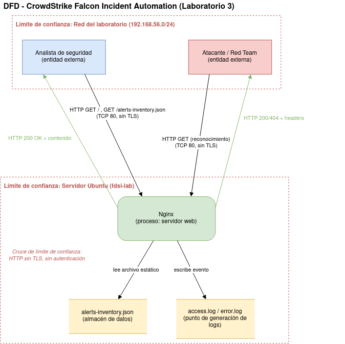
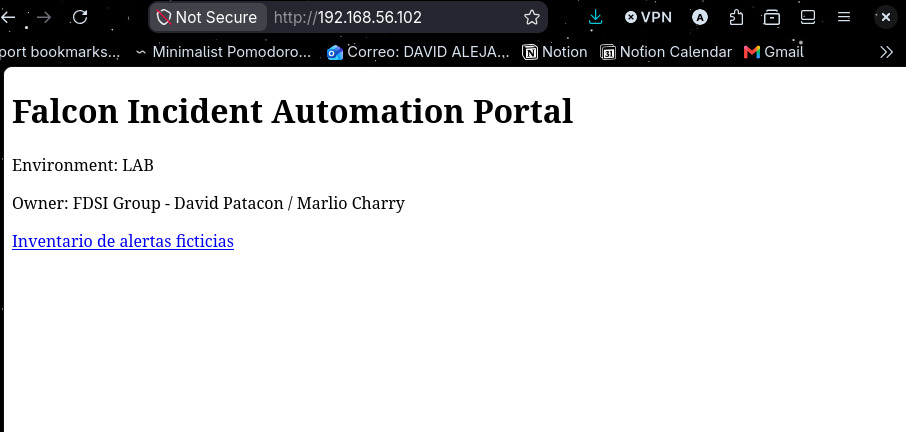
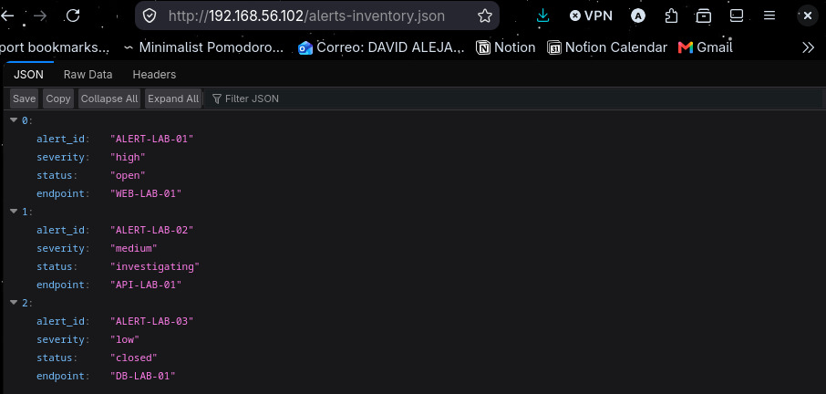

# CrowdStrike Falcon - Incident Automation Lab

## Portada

| Campo | Detalle |
|---|---|
| Universidad | [COMPLETAR] |
| Facultad / Programa | [COMPLETAR] |
| Asignatura | Fundamentos de Seguridad de la Información (FDSI) |
| Docente | [COMPLETAR] |
| Grupo / Código de curso | [COMPLETAR] |
| Laboratorio | Laboratorio 3 — Secure Product Challenge |
| Integrantes | David Alejandro Patacón Henao<br>Marlio Jose Charry Espitia |
| Fecha de entrega | [COMPLETAR] |

Laboratorio 3 (Secure Product Challenge) de la asignatura FDSI. Prototipo académico que simula la recepción y consulta de alertas de seguridad de CrowdStrike Falcon mediante un servicio HTTP público sin autenticación, como línea base deliberadamente insegura para el ciclo Construir → Atacar → Detectar → Corregir → Verificar.

## Descripción del proyecto

**Problema seleccionado.** Actualmente la recepción, clasificación y escalamiento de alertas de seguridad requiere actividades manuales que aumentan los tiempos de respuesta y dificultan la correlación de evidencias.

**Objetivo de la primera versión.** Exponer un endpoint HTTP mínimo que sirva un portal de bienvenida y un inventario de alertas ficticias, para validar el flujo completo de despliegue (repositorio → servidor → Nginx) antes de incorporar controles de seguridad (TLS, autenticación, RBAC) en laboratorios posteriores.

**Usuarios previstos.** Analista de seguridad (consulta alertas) y Blue Team (observa/audita el servicio); ver `risk-register.md` para el detalle completo de actores.

**Datos ficticios que utilizará.** `app/alerts-inventory.json` contiene tres alertas inventadas (`alert_id`, `severity`, `status`, `endpoint`, p. ej. `ALERT-LAB-01`). No se usa información real ni se integra con la API real de CrowdStrike. Todos los datos (alertas, endpoints, IDs) son ficticios.

**Alcance y exclusiones.** Ver "Alcance de esta entrega" a continuación.

**Resultado esperado del despliegue.** Portal accesible por HTTP en la red del laboratorio (`http://192.168.56.102/`), sirviendo `index.html` y `alerts-inventory.json` con código `200 OK`, verificado con `curl` tanto en ejecución local como en el servidor Nginx (ver "Evidencias").

## Alcance de esta entrega

- Servicio HTTP (puerto 80), **sin TLS y sin autenticación**, tal como exige el Laboratorio 3.
- Contenido estático servido por Nginx: página de bienvenida e inventario de alertas ficticias en JSON.
- Identificación de riesgos mediante modelo de amenazas STRIDE, con hardening inicial aplicado donde fue posible.
- **Fuera de alcance** (se corrige en Laboratorio 4): HTTPS/TLS, autenticación, autorización por roles, integración real con la API de Falcon.

## Arquitectura y entorno de despliegue

Por no contar con créditos de nube, el "servidor autorizado" del laboratorio se implementó como una máquina virtual local en VirtualBox, en lugar de una instancia cloud.

| Componente | Detalle |
|---|---|
| Host de VirtualBox | CachyOS (Linux, base Arch) |
| Hipervisor | VirtualBox 7.x, módulo `virtualbox-host-dkms` |
| VM | Ubuntu Server 26.04 LTS, hostname `fdsi-lab` |
| Red 1 (NAT) | Salida a internet de la VM (actualizaciones, `apt`, `git`) |
| Red 2 (Host-only, `vboxnet0`) | `192.168.56.0/24` — simula el segmento "autorizado" del laboratorio. IP de la VM: `192.168.56.102` (asignada por el DHCP interno de VirtualBox) |
| Servicio web | Nginx, sirviendo contenido estático desde `/var/www/crowdstrike-lab` |
| Firewall | `ufw`, solo permite HTTP (80) desde `192.168.56.0/24` y SSH |


## Estructura del repositorio

```
LAB_FDSI_DavidPatacon_MarlioCharry/
├── app/
│   ├── index.html                  # Página del portal (contenido ficticio)
│   └── alerts-inventory.json       # Inventario de alertas ficticias
├── nginx/
│   └── crowdstrike-lab.conf        # Virtual host desplegado en el servidor
├── diagrams/
│   └── dfd-lab3.png                 # DFD del sistema
├── evidence/
│   ├── local/
│   │   ├── http-server-test.txt              # Prueba local (python3 -m http.server)
│   │   └── local-run-evidence.txt            # git status / git log / find
│   └── server/
│       ├── nginx-server-evidence.txt         # hostname, nginx -v, systemctl status, nginx -t, curl -I, timestamp
│       ├── nginx-config.txt                  # Configuración real aplicada
│       ├── dir-permissions.txt               # Permisos de /var/www/crowdstrike-lab
│       ├── access-log-extract.txt            # Extracto de access.log
│       ├── error-log-extract.txt             # Extracto de error.log
│       ├── stride-evidence.txt               # Evidencia puntual del modelo de amenazas
│       ├── screenshot-browser-home.png       # Captura: navegador mostrando el portal
│       └── screenshot-browser-alerts-json.png # Captura: navegador mostrando alerts-inventory.json
├── risk-register.md                # Activos, actores, límites de confianza y tabla STRIDE
└── README.md
```

## Requisitos

- Ubuntu Server 26.04 LTS (o superior)
- Nginx
- Python 3 (solo para la prueba de ejecución local)
- Git

## Ejecución local

Sirve el contenido estático sin necesidad de Nginx, para verificar que `index.html` y `alerts-inventory.json` son válidos antes de desplegar:

```bash
cd app
python3 -m http.server 8080
# abrir http://localhost:8080
```

Evidencia de esta prueba (fecha, código HTTP obtenido): `evidence/local/http-server-test.txt`.

## Procedimiento de despliegue

Pasos ejecutados sobre la VM Ubuntu Server (`192.168.56.102`):

1. **Instalar Nginx**
   ```bash
   sudo apt update
   sudo apt install -y nginx
   sudo systemctl enable --now nginx
   ```
2. **Publicar el contenido**
   ```bash
   sudo mkdir -p /var/www/crowdstrike-lab
   # copiar app/index.html y app/alerts-inventory.json a /var/www/crowdstrike-lab
   ```
3. **Configurar el virtual host**
   ```bash
   sudo cp nginx/crowdstrike-lab.conf /etc/nginx/sites-available/crowdstrike-lab
   sudo ln -s /etc/nginx/sites-available/crowdstrike-lab /etc/nginx/sites-enabled/crowdstrike-lab
   sudo rm -f /etc/nginx/sites-enabled/default
   sudo nginx -t
   sudo systemctl reload nginx
   ```
4. **Restringir el firewall al segmento del laboratorio**
   ```bash
   sudo ufw allow OpenSSH
   sudo ufw default deny incoming
   sudo ufw default allow outgoing
   sudo ufw allow from 192.168.56.0/24 to any port 80 proto tcp
   sudo ufw enable
   ```
5. **Verificar** desde fuera de la VM: `curl -i http://192.168.56.102/` → `200 OK`.

Evidencia completa de este procedimiento (versión de Nginx, estado del servicio, sintaxis validada, headers, permisos, extractos de logs): carpeta `evidence/server/`.

## URL publicada

`http://192.168.56.102/` — red host-only de VirtualBox (entorno de laboratorio local, sin exposición a internet por falta de créditos cloud). Accesible únicamente desde el host de VirtualBox y otras VMs conectadas a la misma red `vboxnet0`.


## Diagrama de flujo de datos (DFD)




## Modelo de amenazas

Análisis STRIDE completo (activos, actores, límites de confianza, superficie de ataque y la tabla de riesgos con evidencia y mitigación propuesta), construido directamente sobre los elementos del DFD (`diagrams/dfd-lab3.png`).

## Registro de riesgos

Detalle completo (activos, actores, límites de confianza, superficie de ataque y tabla STRIDE con evidencia y mitigación) en [`risk-register.md`](risk-register.md).

Resumen de hallazgos: 4 riesgos pendientes para el Laboratorio 4 (Spoofing, Tampering, Repudiation, Elevation of Privilege — todos derivados de la ausencia de TLS y autenticación), 1 mitigado parcialmente en este laboratorio (Information Disclosure, mediante `server_tokens off`), y 1 aceptado temporalmente (Denial of Service, sin `limit_req`, previsto para el Laboratorio 6).


## Evidencias

### Ejecución local

**`evidence/local/http-server-test.txt`** — prueba con `python3 -m http.server 8080`, fecha y código HTTP obtenido:

```text
=== timestamp ===
2026-09-12T20:44:53Z
=== curl -I ===
HTTP/1.0 200 OK
Server: SimpleHTTP/0.6 Python/3.14.7
Date: Sat, 12 Sep 2026 20:44:53 GMT
Content-type: text/html
Content-Length: 348
Last-Modified: Sat, 12 Sep 2026 20:40:50 GMT
```

**`evidence/local/local-run-evidence.txt`** — estado y commit del repositorio evaluado:

```text
=== git status ===
On branch main
Your branch is ahead of 'origin/main' by 1 commit.

Untracked files:
        evidence/local/local-run-evidence.txt

=== git log ===
4c015fe lab3: estructura del repo, README y app copiada del servidor
d08510a Fase A paso 3
9c4a684 Fase A paso 2
9b40b94 Fase A paso 1
b0258b0 inital lab3 config

=== find ===
./app/index.html
./app/alerts-inventory.json
./nginx/crowdstrike-lab.conf
./evidence/local/http-server-test.txt
./evidence/local/local-run-evidence.txt
./README.md
```

### Servidor y Nginx

**`evidence/server/nginx-server-evidence.txt`**:

```text
=== hostname ===
fdsi-lab
=== whoami ===
vboxuser
=== pwd ===
/home/vboxuser
=== systemctl status nginx ===
● nginx.service - A high performance web server and a reverse proxy server
     Active: active (running) since Sat 2026-09-12 20:29:48 UTC; 17min ago
   Main PID: 2711 (nginx)
      Tasks: 3 (limit: 1715)
     Memory: 3.2M (peak: 7M)
=== curl -I localhost ===
HTTP/1.1 200 OK
Server: nginx/1.28.3 (Ubuntu)
Date: Sat, 12 Sep 2026 20:47:40 GMT
Content-Type: text/html
Content-Length: 348
Last-Modified: Sat, 12 Sep 2026 20:31:19 GMT
Connection: keep-alive
ETag: "6aa5b697-15c"
Accept-Ranges: bytes
=== timestamp ===
2026-09-12T20:47:40Z
=== nginx -v ===
nginx version: nginx/1.28.3 (Ubuntu)
=== nginx -t ===
nginx: the configuration file /etc/nginx/nginx.conf syntax is ok
nginx: configuration file /etc/nginx/nginx.conf test is successful
```

**`evidence/server/nginx-config.txt`** — virtual host desplegado:

```nginx
server {
    listen 80 default_server;
    listen [::]:80 default_server;
    root /var/www/crowdstrike-lab;
    index index.html;
    server_name _;
    location / { try_files $uri $uri/ =404; }
}
```

**`evidence/server/dir-permissions.txt`**:

```text
total 16
drwxr-xr-x 2 root root 4096 Sep 12 20:31 .
drwxr-xr-x 4 root root 4096 Sep 12 20:30 ..
-rw-r--r-- 1 root root  302 Sep 12 20:31 alerts-inventory.json
-rw-r--r-- 1 root root  348 Sep 12 20:31 index.html
```

**`evidence/server/access-log-extract.txt`**:

```text
127.0.0.1 - - [12/Sep/2026:20:33:46 +0000] "GET / HTTP/1.1" 200 348 "-" "curl/8.18.0"
127.0.0.1 - - [12/Sep/2026:20:34:12 +0000] "GET / HTTP/1.1" 200 348 "-" "curl/8.18.0"
127.0.0.1 - - [12/Sep/2026:20:35:00 +0000] "GET / HTTP/1.1" 200 348 "-" "curl/8.18.0"
127.0.0.1 - - [12/Sep/2026:20:35:32 +0000] "GET / HTTP/1.1" 200 348 "-" "curl/8.18.0"
192.168.56.102 - - [12/Sep/2026:20:36:52 +0000] "GET / HTTP/1.1" 200 348 "-" "curl/8.18.0"
::1 - - [12/Sep/2026:20:47:40 +0000] "HEAD / HTTP/1.1" 200 0 "-" "curl/8.18.0"
```

**`evidence/server/error-log-extract.txt`**:

```text
2026/09/12 20:29:49 [notice] 2711#2711: using inherited sockets from "5;6;"

```

### Evidencia servidor corriendo en la VM




### Diagnóstico del fallo

No aplica: el despliegue fue exitoso en todos los pasos verificados.

| Prueba | Esperado | Obtenido | Evidencia |
|---|---|---|---|
| `curl localhost` (servidor) | HTTP 200 | HTTP 200 | `evidence/server/nginx-server-evidence.txt` |
| `nginx -t` | Syntax OK | Syntax OK | `evidence/server/nginx-server-evidence.txt` |
| Acceso desde la red del laboratorio | Página visible | Página visible | `evidence/server/screenshot-browser-home.png` |
| Carga de contenido (JSON) | HTTP 200 | HTTP 200 | `evidence/server/screenshot-browser-alerts-json.png` |

### Modelo de amenazas

**`evidence/server/stride-evidence.txt`** — evidencia puntual para las filas de Information Disclosure, Denial of Service y Elevation of Privilege de `risk-register.md`:

```text
=== server_tokens (antes) ===
Server: nginx/1.28.3 (Ubuntu)
=== limit_req configurado? ===
NINGUNO ENCONTRADO
=== metodo POST bloqueado? ===
HTTP/1.1 405 Not Allowed
Server: nginx/1.28.3 (Ubuntu)
Date: Sat, 12 Sep 2026 21:53:07 GMT
```

## Limitaciones de seguridad conocidas

- **Sin cifrado (HTTP, no HTTPS)**: el tráfico viaja en texto plano; cualquier host en el segmento `192.168.56.0/24` puede observarlo. Se corrige en el Laboratorio 4 con TLS.
- **Sin autenticación ni autorización**: cualquier host del segmento puede consultar `/` y `/alerts-inventory.json` sin credenciales. Se corrige en el Laboratorio 4 (identidad, sesiones y roles).
- **Sin protección contra fuerza bruta ni límites de tasa**: no hay `limit_req` configurado en Nginx. Aceptado para esta entrega, previsto para el Laboratorio 6 (WAF).
- **Trazabilidad limitada**: los logs de Nginx registran IP, timestamp y método, pero no identidad de usuario (no existe autenticación todavía).
- Detalle completo de cada limitación, su evidencia y mitigación propuesta: ver `risk-register.md`.